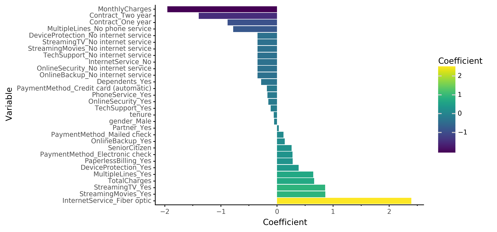

# Churn Analysis

Simple steps to build some models to predict customer churn.   
V0.1

Python project to build 6 different models (Logistic regression, random forest, SVC, XGBoost, LGBM, and an MLP neural net) and tune hyperparameters to improve prediction of customer churn. 

**Coefficient Strength from Logistic Regression Model**

To do list:
* Update fit_and_report function for easier reading of model metrics
* Feature engineering

Full post here:
https://timcashion.github.io/2020/02/churn/

Original dataset from here:
https://www.kaggle.com/blastchar/telco-customer-churn
